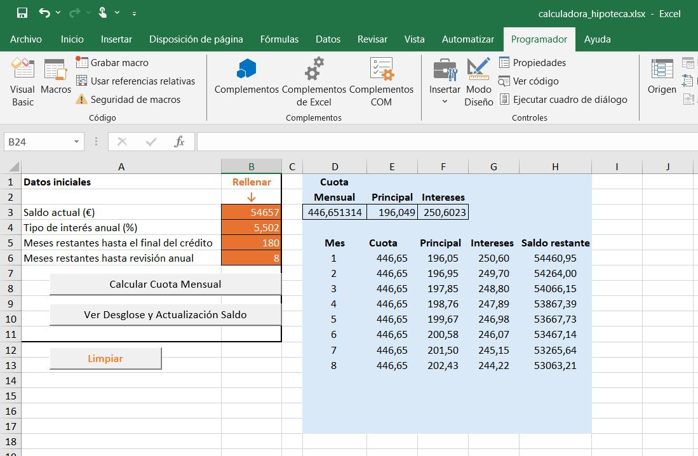
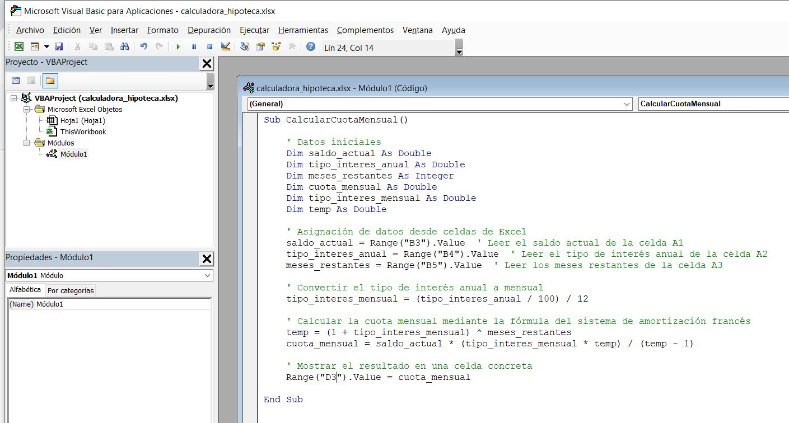
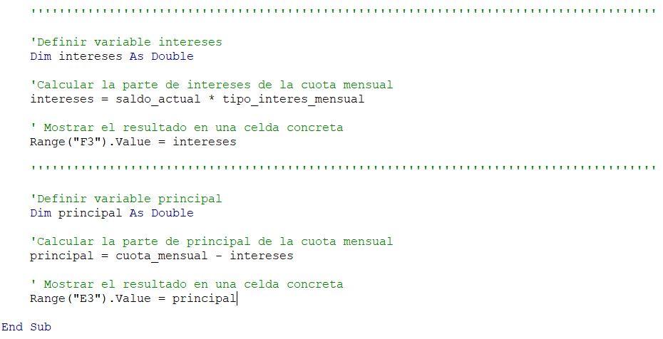
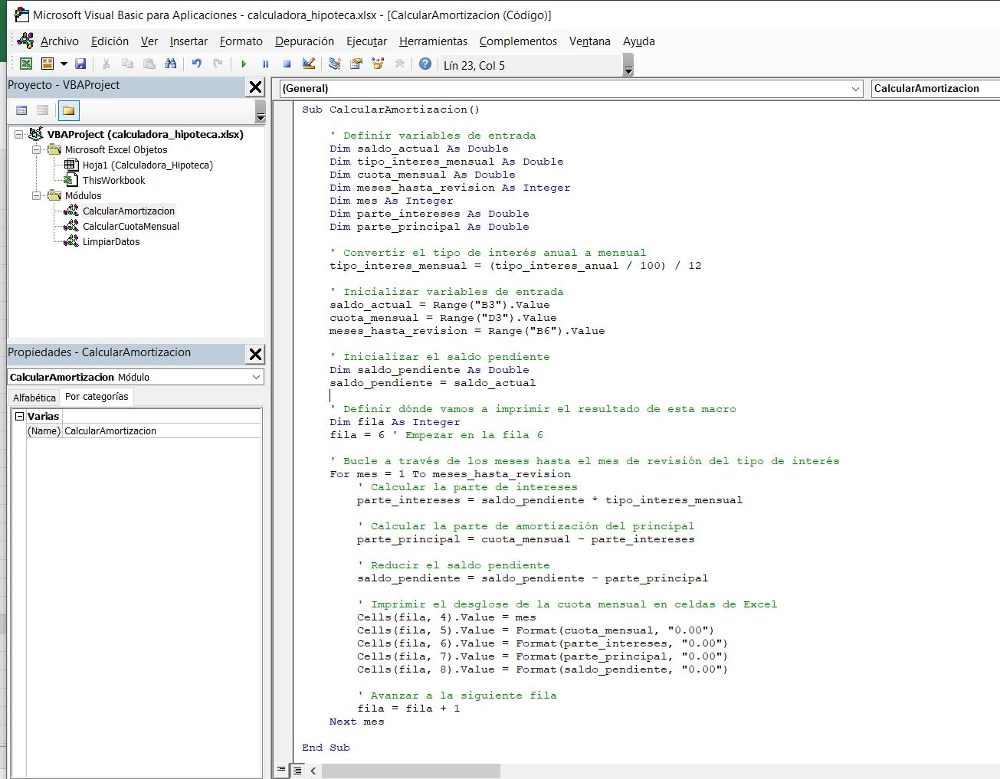
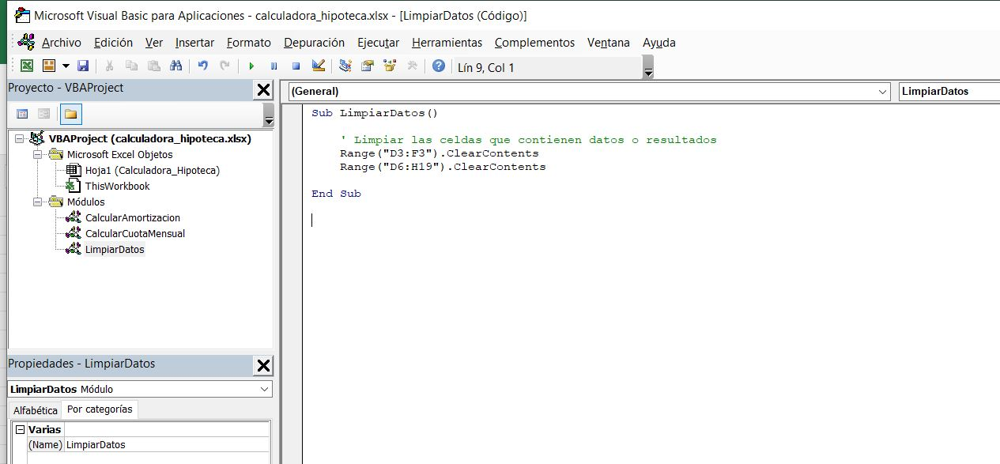

# vba_excel_calculadora_hipoteca

Cómo activar Macros tras haber sido desactivadas por Microsoft al abrir el archivo .xlsm:

https://support.microsoft.com/es-es/topic/se-ha-bloqueado-una-macro-potencialmente-peligrosa-0952faa0-37e7-4316-b61d-5b5ed6024216

