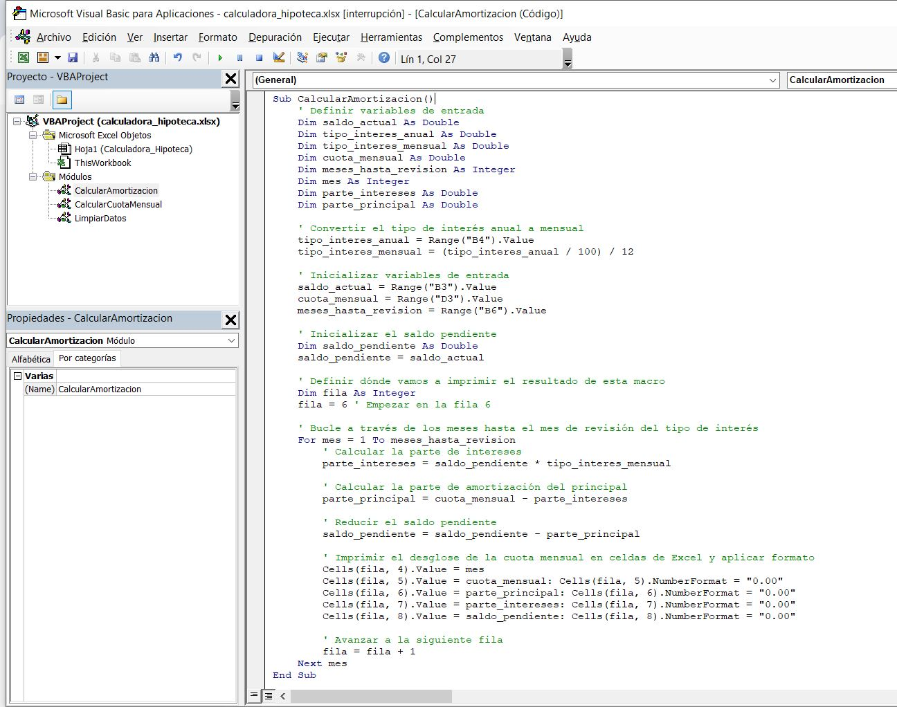

# vba_excel_calculadora_hipoteca
### Esta calculadora está pensada para hipotecas a tipo variable.

Cómo activar Macros tras haber sido desactivadas por Microsoft al abrir el archivo .xlsm:

https://support.microsoft.com/es-es/topic/se-ha-bloqueado-una-macro-potencialmente-peligrosa-0952faa0-37e7-4316-b61d-5b5ed6024216

### Captura mostrando el código de la macro que calcula la cuota mensual del año en curso:

### Detalle del cálculo de la parte de intereses y de la parte del principal:

### Captura mostrando las cuotas mensuales hasta la revisión del préstamo, desglosado en principal, intereses y saldo actualizado:

### Captura de la limpieza de datos para recomenzar un nuevo cálculo:

